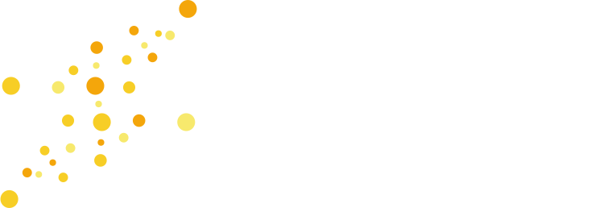

<div align="center">
<picture>
  <source media="(prefers-color-scheme: dark)" srcset="docs/assets/img/logo_dark.svg">
  <source media="(prefers-color-scheme: light)" srcset="docs/assets/img/logo_light.svg">
  
</picture>
<h1>Deep Learning Energy Measurement and Optimization</h1>
</div>

[](https://www.usenix.org/conference/nsdi23/presentation/you)
[](https://hub.docker.com/r/symbioticlab/zeus)
[](https://join.slack.com/t/zeus-ml/shared_invite/zt-1najba5mb-WExy7zoNTyaZZfTlUWoLLg)
[](https://github.com/SymbioticLab/Zeus/actions/workflows/deploy_homepage.yaml)
[](/LICENSE)

---
**Project News** ⚡ 

- \[2023/07\] [`ZeusMonitor`](https://ml.energy/zeus/reference/monitor/#zeus.monitor.ZeusMonitor) was used to profile GPU time and energy consumption for the [ML.ENERGY leaderboard](https://ml.energy/leaderboard).
- \[2023/03\] [Chase](https://symbioticlab.org/publications/files/chase:ccai23/chase-ccai23.pdf), an automatic carbon optimization framework for DNN training, will appear at ICLR'23 workshop.
- \[2022/11\] [Carbon-Aware Zeus](https://taikai.network/gsf/hackathons/carbonhack22/projects/cl95qxjpa70555701uhg96r0ek6/idea) won the **second overall best solution award** at Carbon Hack 22.
---

Zeus is a framework for (1) measuring GPU energy consumption and (2) optimizing energy and time for DNN training.

### Measuring GPU energy

```python
from zeus.monitor import ZeusMonitor

monitor = ZeusMonitor(gpu_indices=[0,1,2,3])

monitor.begin_window("heavy computation")
# Four GPUs consuming energy like crazy!
measurement = monitor.end_window("heavy computation")

print(f"Energy: {measurement.total_energy} J")
print(f"Time  : {measurement.time} s")
```

### Finding the optimal GPU power limit

Zeus silently profiles different power limits during training and converges to the optimal one.

```python
from zeus.monitor import ZeusMonitor
from zeus.optimizer import GlobalPowerLimitOptimizer

monitor = ZeusMonitor(gpu_indices=[0,1,2,3])
plo = GlobalPowerLimitOptimizer(monitor)

plo.on_epoch_begin()

for x, y in train_dataloader:
    plo.on_step_begin()
    # Learn from x and y!
    plo.on_step_end()

plo.on_epoch_end()
```

Please refer to our NSDI’23 [paper](https://www.usenix.org/conference/nsdi23/presentation/you) and [slides](https://www.usenix.org/system/files/nsdi23_slides_chung.pdf) for details.
Checkout [Overview](https://ml.energy/zeus/overview/) for a summary.

Zeus is part of [The ML.ENERGY Initiative](https://ml.energy).

## Repository Organization

```
.
├── zeus/                # ⚡ Zeus Python package
│   ├── optimizer/       #    - GPU energy and time optimizers
│   ├── run/             #    - Tools for running Zeus on real training jobs
│   ├── policy/          #    - Optimization policies and extension interfaces
│   ├── util/            #    - Utility functions and classes
│   ├── monitor.py       #    - `ZeusMonitor`: Measure GPU time and energy of any code block
│   ├── controller.py    #    - Tools for controlling the flow of training
│   ├── callback.py      #    - Base class for Hugging Face-like training callbacks.
│   ├── simulate.py      #    - Tools for trace-driven simulation
│   ├── analyze.py       #    - Analysis functions for power logs
│   └── job.py           #    - Class for job specification
│
├── zeus_monitor/        # 🔌 GPU power monitor
│   ├── zemo/            #    -  A header-only library for querying NVML
│   └── main.cpp         #    -  Source code of the power monitor
│
├── examples/            # 🛠️ Examples of integrating Zeus
│
├── capriccio/           # 🌊 A drifting sentiment analysis dataset
│
└── trace/               # 🗃️ Train and power traces for various GPUs and DNNs
```

## Getting Started

Refer to [Getting started](https://ml.energy/zeus/getting_started) for complete instructions on environment setup, installation, and integration.

### Docker image

We provide a Docker image fully equipped with all dependencies and environments.
The only command you need is:

```sh
docker run -it \
    --gpus all                  `# Mount all GPUs` \
    --cap-add SYS_ADMIN         `# Needed to change the power limit of the GPU` \
    --ipc host                  `# PyTorch DataLoader workers need enough shm` \
    symbioticlab/zeus:latest \
    bash
```

Refer to [Environment setup](https://ml.energy/zeus/getting_started/environment/) for details.

### Examples

We provide working examples for integrating and running Zeus in the `examples/` directory.


## Extending Zeus

You can easily implement custom policies for batch size and power limit optimization and plug it into Zeus.

Refer to [Extending Zeus](https://ml.energy/zeus/extend/) for details.


## Carbon-Aware Zeus

The use of GPUs for training DNNs results in high carbon emissions and energy consumption. Building on top of Zeus, we introduce *Chase* -- a carbon-aware solution. *Chase* dynamically controls the energy consumption of GPUs; adapts to shifts in carbon intensity during DNN training, reducing carbon footprint with minimal compromises on training performance. To proactively adapt to shifting carbon intensity, a lightweight machine learning algorithm is used to forecast the carbon intensity of the upcoming time frame. For more details on Chase, please refer to our [paper](https://symbioticlab.org/publications/files/chase:ccai23/chase-ccai23.pdf) and the [chase branch](https://github.com/SymbioticLab/Zeus/tree/chase). 


## Citation

```bibtex
@inproceedings{zeus-nsdi23,
    title     = {Zeus: Understanding and Optimizing {GPU} Energy Consumption of {DNN} Training},
    author    = {Jie You and Jae-Won Chung and Mosharaf Chowdhury},
    booktitle = {USENIX NSDI},
    year      = {2023}
}
```

## Contact
Jae-Won Chung (jwnchung@umich.edu)
