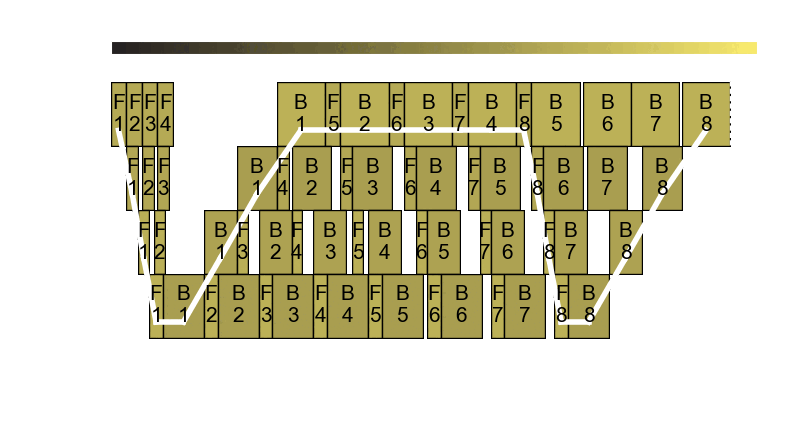

# Pipeline Frequency Optimizer

The pipeline frequency optimizer optimizes the energy consumption of large model training, e.g., LLM pretraining.

The core observation is that in pipeline parallel training, it is very difficult to split pipeline stages in perfectly equal size.
Even for models like GPT, the first stage has the embeddings and the last stage has the language model head, making perfect balance nearly impossible to achieve.
The pipeline frequency optimizer is based on our research paper Perseus.
For more details about Perseus, check out our [blog post](../research_overview/perseus.md).

<figure>
  
  <figcaption>The pipeline frequency optimizer in action</figcaption>
</figure>

## Usage

Currently, it's a three-step process:

1. **Profile**: Profile the computation time and energy consumption of the forward and backward instructions in *each stage* and *each GPU frequency* and the P2P blocking power consumption of the GPU.
2. **Optimize**: Use [`lowtime`](https://github.com/ml-energy/lowtime){.external} to generate all Pareto-optimal frequency plans.
3. **Choose and start training**: Among all the frequency plans generated by `lowtime`, choose the one that suits your use case.

We have a reference integration with the large model training framework [Merak](https://github.com/ml-energy/merak-zeus){.external}, which supports 3D parallelism and automatically tracing and partitioning Hugging Face models.
We've smoothed out some rough edges, integrated Zeus, and added example training scripts for GPT-3, BERT, and Wide-ResNet (pretty much any `torchvision` model).

You don't have to be tied to Merak.
If you have your own training framework, and you can integrate the pipeline frequency optimizer following [the integration guide](#integrating-with-training-frameworks).

### Profile

In order to run our optimization algorithm, we need the time & energy profiling information of the forward and backward instruction in each stage for every GPU frequency.
The CSV file should look like this for a 4-stage pipeline:

```csv
stage,instruction,frequency,time,energy
0,forward,1740,0.09373254776000976,28.4944
0,forward,1725,0.09390360514322917,28.434366666666666
0,forward,1710,0.09381131331125896,28.288966666666667
...
0,backward,1740,0.24533510557810465,69.5691
0,backward,1725,0.24538559118906658,69.2552
0,backward,1710,0.24548352559407552,68.89453333333334
...
3,backward,690,0.4184921979904175,68.12243333333333
3,backward,675,0.42459266185760497,68.77603333333334
3,backward,660,0.4306272824605306,69.39623333333334
```

Since different frameworks and model implementations will have different performance, it's best to obtain these profiling results on the framework and model you'll be using.
That being said, you can obtain this profiling information in however way you want as long as they have all the columns in the reference CSV file above.
But as a reference, we have implemented an automatic profiler in Merak.
Please refer to the [examples](https://github.com/ml-energy/merak-zeus/tree/main/examples){.external} directory in Merak for profiling instructions.

Finally, we also need to take into account the power consumption of the GPU while it is blocking on P2P communication, i.e., waiting for either the activation or gradient from its neighbor stage.
You can use [our profiling script](https://github.com/ml-energy/zeus/tree/master/examples/pipeline_frequency_optimizer/profile_p2p.py){.external} for that.

!!! Tip
    As you profile the time and energy consumption of an instruction, you will scan down from the highest to the lowest frequency.
    However, as you lower the GPU's frequency, both time and energy will start to inflate after some point.
    In other words, those frequencies take more time **and** energy and are simply inefficient (i.e., Pareto-suboptimal), so we won't be running anything with those frequencies.
    Therefore, you actually don't need to profile time and energy for *every* frequency.
    A good heuristic is to scan from higher frequencies to lower ones, and once energy consumption increases more than five *consecutive* times, just stop there.

### Optimize

With the CSV file that holds profiling results, you can use `lowtime` to generate all Pareto-optimal frequency plans.

See [`examples/pipeline_frequency_optimizer`](https://github.com/ml-energy/zeus/tree/master/examples/pipeline_frequency_optimizer){.external} to find the script `run_optimization.py`.

### Choose and start training

Running `lowtime` optimization will produce a set of frequency assignment files (`freqs_pipeline_%05d.py`).
Each file is also annotated with estimates for time and cost.
The larger the number, the shorter the expected iteration time.

Then, start the PFO server and plug in the frequency plan you chose:

```console
$ docker exec -it merak-zeus bash
# pip install '.[pfo-server]'
# ZEUS_PFO_SCHEDULER_ARGS='{"solution_path": "path/to/freqs_pipeline_%05d.py"}' uvicorn zeus.optimizer.pipeline_frequency.server.router:app --port 7787
```

When you run training (with the same `run.sh` but without `--profile true`), the [`PipelineFrequencyOptimizer`][zeus.optimizer.pipeline_frequency.optimizer.PipelineFrequencyOptimizer] integrated into your training framework will automatically talk with the PFO server to figure out the right GPU frequency to set for the upcoming pipeline instruction and transparently set the GPU's frequency.

## Integrating with training frameworks

This page aims to walk you through the process of integrating the pipeline frequency optimizer with arbitrary training frameworks.
We also have a reference integration with [Merak](https://github.com/ml-energy/merak-zeus){.external}.
Especially take a look at `Merak.runtime.pipe_engine`.

### Assumptions

We assume that there are concrete regions of the framework's code where the forward pass and the backward pass exclusively happens.
For instance, in DeepSpeed, `PipelineEngine` has [`_exec_forward_pass`](https://github.com/microsoft/DeepSpeed/blob/4fc181b01077521ba42379013ce91a1c294e5d8e/deepspeed/runtime/pipe/engine.py#L626){.external} and [`_exec_backward_pass`](https://github.com/microsoft/DeepSpeed/blob/4fc181b01077521ba42379013ce91a1c294e5d8e/deepspeed/runtime/pipe/engine.py#L703){.external}.
As another example, in Megatron-LM, users can pass in their custom `forward_step_func` to `pretrain`, and [`forward_step`](https://github.com/NVIDIA/Megatron-LM/blob/79a9feef261352ac1ee80b36f2cf73c20f864965/megatron/core/pipeline_parallel/schedules.py#L149){.external} in the codebase calls it. The backward pass is done (roughly) in the [`backward_step`](https://github.com/NVIDIA/Megatron-LM/blob/79a9feef261352ac1ee80b36f2cf73c20f864965/megatron/core/pipeline_parallel/schedules.py#L216){.external} function.

### Integrate `PipelineFrequencyOptimizer`

1. Add `zeus[pfo]` to your dependencies.
1. Instantiate the [`PipelineFrequencyOptimizer`][zeus.optimizer.pipeline_frequency.optimizer.PipelineFrequencyOptimizer] somewhere before actual training runs. Let's call the object `opt`.
1. Surround one training step with `opt.on_step_begin()` and `opt.on_step_end()`.
1. Wrap the forward pass region with `opt.on_instruction_begin("forward")` and `opt.on_instruction_end("forward")`.
1. Wrap the backward pass region with `opt.on_instruction_begin("backward")` and `opt.on_instruction_end("backward")`.

### Profiling Instructions

It's important to optimize on top of accurate measurements of forward and backward instructions.
For now, we're taking an offline approach, where we run each instruction under a given GPU frequency N times and average time and energy consumption.
See [Merak's `profile` function](https://github.com/ml-energy/merak-zeus/blob/40eb07f80b3b3c2905bde303b02a6f707193f083/Merak/merak_trainer.py#L620){.external}.

We're on the process of implementing an online approach that is directly integrated into [`PipelineFrequencyOptimizer`][zeus.optimizer.pipeline_frequency.optimizer.PipelineFrequencyOptimizer] so that you don't need to implement a separate profiler inside your framework.
