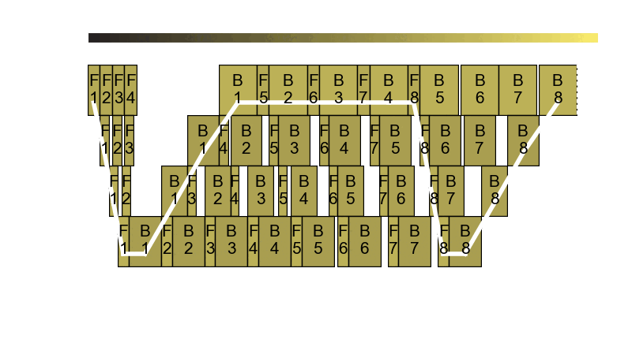

<h1>Perseus: Removing Energy Bloat from Large Model Training</h1>

[**Preprint**](https://arxiv.org/abs/2312.06902)

## Overview

Large model training requires the distribution of work to multiple GPUs.
The core observation of Perseus is that especially for pipeline parallelism, work cannot be perfectly split and balanced across every GPU; some GPUs have more work to do and some less.
GPUs with smaller amounts of work finish before GPUs with more amounts of work, but ultimately training throughput is bound by GPUs with the most amount of work.
In other words, GPUs with lighter load are running unnecessarily fast and wasting energy (i.e., there is **energy bloat**).

<figure>
  
  <figcaption>The pipeline frequency optimizer in action</figcaption>
</figure>

We reduce energy bloat by controlling the execution speed of each pipeline instruction (forward and backward) in each stage by controlling the GPU's frequency in a fine-grained manner.
We call the assignment of a GPU frequency to each pipeline instruction *frequency plan*, and Perseus gives you **every Pareto-optimal frequency plan** that you can choose any point on the iteration time--energy Pareto frontier.
These plans include frequency plans that do not make training any slower compared to not using Perseus at all, but yield free energy savings.
If you have a bit more leeway as to when training should finish (e.g., You're good as long as training finishes by tomorrow morning), you can pick the frequency plan that slows down training by a couple percentages and save more energy.

<figure>

<figcaption>Perseus discovers the entire iteration time--energy Pareto frontier.</figcaption>
</figure>

Perseus finds the training time--energy Pareto frontier of large model training.
Users can pick any point on the frontier -- be it minimum time, minimum energy, or something in the middle, depending on the training deadline.
